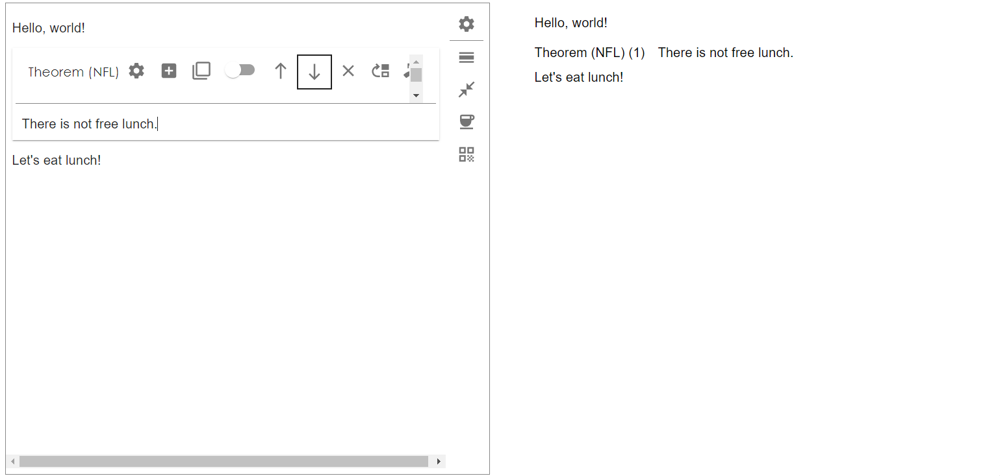

In this page, we show the basic usage of YText by creating a simple example project.

## Installation

Make sure you are in a [React](https://reactjs.org/) project and simply use npm to install YText:
```
npm install @ftyyy/ytext
```
and can import ytext in your code:
```javascript
import * from "@ftyyy/ytext"
```

## Use YText in your Project

In this section, we set up an example project to show how to use YText. There are three major steps: create concepts, create printer, and create editor.

### Create Concepts 

First import necessary classes from YText:
```javascript
import {
	FirstClassConcept , 
	SecondClassConcept ,  
} from "@ftyyy/ytext"
```
Then create a first class concept, say we want to write a mathmatics paper, hence we create a concept for propositions:
```javascript
let math = new FirstClassConcept({
	type:"group" , 
	name: "math" , 
	parameter_prototype: {
		name: {
			val: "Proposition", 
			type: "string" , 
		} , 
	}
})
```
As we know, there are different types of propositions in a mathmatics paper (e.g. Theorems, Lemmas, Corollaries). 
We create a second class concept that inherits the first class concept we just created and override its parameters:
```javascript
let theorem = new SecondClassConcept({
	type: "group" , 
	first_concept: "math" , // each first class concept is referred by its type and name.
	name: "theorem" , 
	default_override: { // parameters that allow users to determine.
		alias: {
			val: "" , 
			type: "string" , 
		} , 
	} , 
	fixed_override: { // assigning values to the first class concept parameters.
		name: { 
			val: "p => p.alias.val ? `Theorem (${p.alias.val})` : 'Theorem'" , 

			// this type allow dynamic value that depends on the parameters of the second class concept
			type: "function" , 
		}
	}
})
```
(Actually, this is not the best way to define a theorem concept. Here I just want to display the usage of function-type parameters.)

### Creating Printer

Next, we need to define how to transfer a __first class__ concept node into a visual element (A node in React). 
YText provides abundant tools to develop your own printer. First we need to import the tools that we will use:
```javascript
import {
	PreprocessInformation , 
	GroupNode , 

	OrderContexter , 
	get_default_group_renderer , 
	DefaultAbstractRendererAsProperty , 
	PrinterStructureBoxText , 
	PrinterPartBox , 
} from "@ftyyy/ytext"
```

When rendering nodes, YText use so called __context__ to let each node know its position in the article and its relationship with others.
The detailed machanisms will be introduced later. YText have numerous tools to help build context. They are called __contexters__. Here we will use `OrderContexter`, that allows a node to know its number in the article 
(for example we might want to start a theorem with: "Thm 1: xxx", obviously we don't want to number it manually). 
We can first create a `OrderContexter`:
```javascript
let number_gene = (info:PreprocessInformation<GroupNode>)=>new OrderContexter<GroupNode>("math")
```
Notice that contexters are stateless, so we always create them by functions. Next, we can create a printer. We can use tools that offered by YText. For example `PrinterStructureBoxText` provides a special style for title texts, 
and `PrinterPartBox` provides a margin style for group nodes.
```javascript
let math_printer = get_default_group_renderer({

    // contexters that will be used to creat context.
    contexters: [ 
        number_gene, 
    ] , 

    // the element to start with.
    pre_element: (info: PreprocessInformation<GroupNode>) => {
        let {node , context , parameters , env} = info

        let number = number_gene(info).get_context(context) // generate number.
        let name = parameters.name // get name from parameters.
        
        return <PrinterStructureBoxText inline>{`${name} (${number})`}</PrinterStructureBoxText>
    } , 

    // the box that contains the node
    outer: (props) => {
        return <PrinterPartBox subtitle_like>{props.children}</PrinterPartBox>
    } , 
})
```
We will also need to create default renderers for all the node types. YText also provides tools to simplify that:
```javascript
import {
	get_default_paragraph_renderer , 
	useless_renderer_block , 
	useless_renderer_inline , 
	useless_renderer_text , 
} from "@ftyyy/ytext"

let default_renderers = {
	"group"     : useless_renderer_block , 
    "structure" : useless_renderer_block , 
    "support"   : useless_renderer_block , 
    "abstract"  : useless_renderer_block , 
    "paragraph" : get_default_paragraph_renderer({}) , 
    "inline"    : useless_renderer_inline , 
    "text"      : useless_renderer_text , 
}
```
When YText see a undefined concept, the default printers will be in use. 

### Creating Editor

Next, let's create editors. We can directly use the default editor implementation provide by YText.
```javascript
import {
	get_deafult_group_editor_with_appbar , 
	get_default_editors , 
} from "@ftyyy/ytext"

let math_editor  = get_deafult_group_editor_with_appbar({
    get_label: (node,parameters) => parameters.name
})
```

### Combining Everything Together

Now we have almost done. Let's write a full component with concepts, printers and editors we just defined.
```javascript
import {
	Printer , 
	EditorCore , 
	AbstractNode , 
	PrinterCache , 
	DefaultPrinterComponent , 
	DefaultEditorComponent , 
} from "@ftyyy/ytext"

class App extends React.Component<{} , {
	tree: AbstractNode
}>{
	editor_ref : React.RefObject<DefaultEditorComponent> // reference to editor component.
	printer: Printer
	editorcore: EditorCore
	constructor(props: any){
		super(props)

		let me = this

		// build printer.
		this.printer = new Printer(
			[math] ,    // feed in first class concepts.
			[theorem] , // feed in second class concepts.
			{           // feed in all renderers.
				group: {
					"math": math_printer , 
				} , 
				structure: {} , inline: {} , support: {} , abstract: {} , 
			} , 
			default_renderers , // feed in all default renderers.
		)

		// build editor core.
		this.editorcore = new EditorCore({
			renderers: { // put in renderers.
				group: {
					math: math_editor , 
				} , structure: {} , inline: {} , support: {} , abstract: {} , 
			} , 
			default_renderers: get_default_editors(), // feed in default renderers.
			printer: me.printer , // feed in the printer.
		})
		
        // initialize the inermediate tree.
		this.state = {
			tree: this.editorcore.create_abstract("root")
		}

		this.editor_ref = React.createRef()
	}

	render(){
		let me = this
		return <div>
					
			<div style = {{position: "absolute", width: "48%", left: "1%", top: "1%", height: "98%"}}>
				<DefaultEditorComponent // editor component.
					ref = {me.editor_ref}
					editorcore = {me.editorcore} // input editor core.

                    // This is the initialization of editor, the updates in the tree will not trigger rerendering.
					init_rootchildren = {me.state.tree.children} 

					onSave = {()=>{ // the callback function whem ctrl+S is pressed.
						me.setState({tree: me.editor_ref.current.get_root() as AbstractNode})
						// save the tree to backend.
                        // save(me.state.tree)
					}}
				/>
			</div>

			<div style = {{position: "absolute", width: "48%", left: "51%", top: "1%", height: "98%",}} >
                <DefaultPrinterComponent // printer component.
                    printer = {me.printer} // input printer core.
                    root = {me.state.tree} // the update of state.tree will trigger rerenderring of Printer.
                ></DefaultPrinterComponent>
			</div>
		</div>
	}
}
```

It will result in a React component like this:

The left part is the editing area, where we can write texts and add theorems. 
When pressing ctrl+s, the printer (on the right) will be updated:
